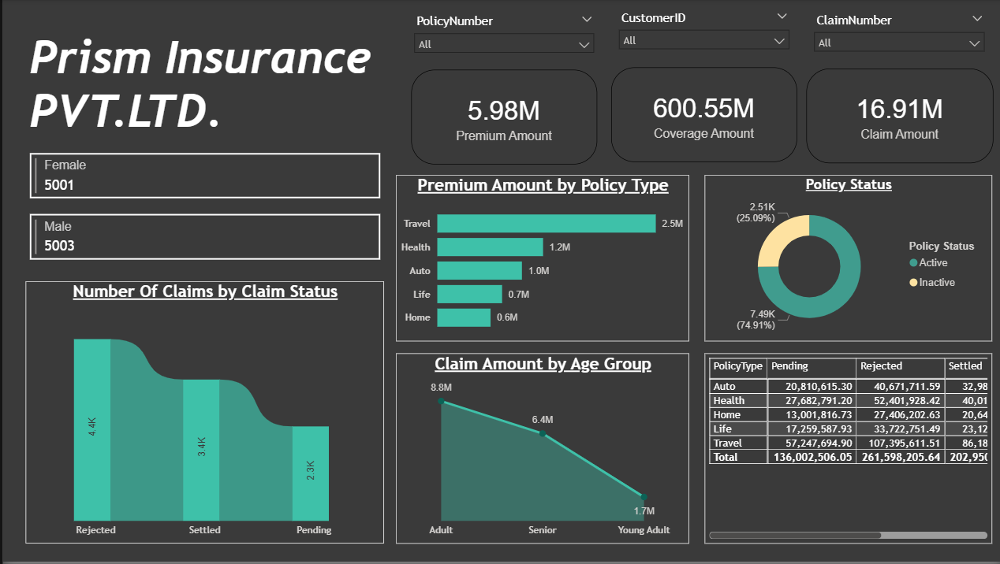
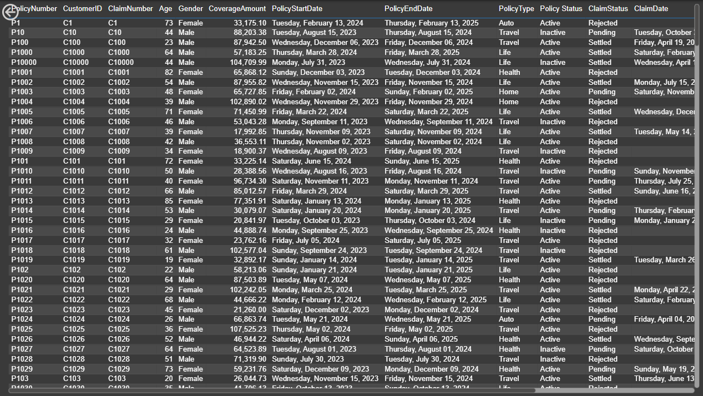

# 📊 Insurance Dashboard Power BI Report

This Power BI report provides an interactive analysis of **Insurance Data**.  
The dashboard is designed with two pages – **Overview** and **Detailed Insights** – to help analyze policies, claims, customers, and revenue.  

---

## 📊 Features

- **Multi-Page Dashboard**: Two interactive pages for overview and detailed analysis.  
- **Interactive Filters (Slicers)**: Drill down by time, geography, and insurance type.  
- **Policy Analysis**: Active, expired, and newly issued policies tracked over time.  
- **Claims Insights**: Claim frequency, approval ratios, and settlement timelines.  
- **Revenue & Premium Trends**: Premium collection, outstanding amounts, and distribution.  
- **Customer Demographics**: Breakdown by region, age group, and insurance type.  
- **Performance KPIs**: Summarized business growth indicators.  

---

## 📑 Report Pages & Visuals

### **Page 1 – Overview Dashboard**
  
- **KPIs**: Active policies, expired policies, total claims, and revenue.  
- **Revenue Trend**: Line/area chart showing premium and revenue growth.  
- **Policy Distribution**: Donut chart displaying share across insurance types.  
- **Regional Performance**: Bar/Column chart highlighting revenue by location.  

---

### **Page 2 – Detailed Table View**
  
- **Comprehensive Table**: Displays detailed policy and claim records in tabular format.  
- **Interactive Filtering**: Users can apply slicers from Page 1 to refine the table view.  
- **Drill-Down Ready**: Use filters to inspect customer-level or policy-level data.  

---

## 🚀 How to Use
1. Open the `.pbix` file in **Power BI Desktop**.  
2. Navigate between **Overview** and **Detailed Insights** pages.  
3. Use slicers (filters) to interact with data by time, geography, or insurance type.  
4. Drill down into visuals for deeper insights.  

---

## 🛠️ Tools Used
- **Power BI Desktop**  
- **Insurance Dataset (Historical/Simulated Data)**  

---

## 📌 Future Improvements
- Adding a **Forecasting Model** for revenue and claims prediction.  
- Enhanced **drill-through reports** for policyholders and claims.   
- Mobile-optimized dashboard view.  
